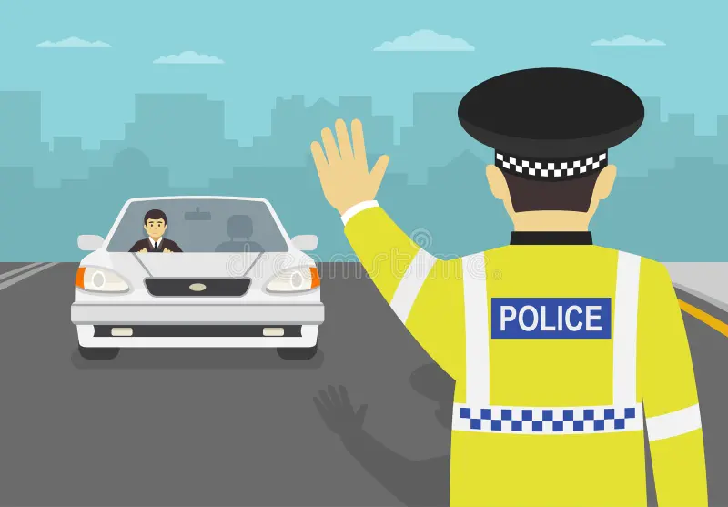

# **TERRY TRAFFIC STOPS-TO-ARREST PREDICTION** 

## **Overview**
Traffic stops are usually made by the police whenever they detect suspicious drivers. However, as much as suspicion exists, not all stops lead to a formal arrest since it may be a situation of mistaken identity or just a false call.This project leverages over 65,000 Seattle Police Department records to predict arrest outcomes, providing a viable data-driven tool for auditing law enforcement transparency. By analyzing the available robust features, the model successfully navigates class imbalance to identify the key factors driving police decision-making.

## **Business Understanding**
This project seeks to develop a predictive model that can accurately forecast whether a traffic stop will result in an arrest. This model aims to assist law enforcement agencies in making informed decisions during traffic stops hence ensuring that adequate resources have been allocated effectively and that officers are better prepared for potential outcomes. Nonetheless, the model also seeks to enhance transparency and accountability within law enforcement by providing insights into the factors that influence arrest decisions.

## **Data Understanding**
The dataset used in this project is sourced from the Seattle Police Department and contains detailed records of traffic stops conducted over several years. The dataset includes various features such as the date and time of the stop, location, officer and subject demographics, reason for the stop, and whether an arrest was made.

## **Data Preparation**
This phase involved several steps to ensure the dataset was clean and suitable for modeling. 
This included:
 * Dropping duplicate entries
 * Handling missing values 
 * Reducing the placeholders used to represent unknown and unidentified data entries.
 * Encoding categorical variables and normalizing numerical features. 
 
 Additionally, I also the necessity for feature engineering to create new variables that could enhance the model's predictive power.

## **Feature Engineering**
The following new features were created to enhance the predictive power of the model:
 * Extracted the Hour, Month, DayOfWeek and Year from the `Occurred Date` column so as to be able to effectively study arrest patterns  by hour, Month, DayOfWeek and Year respectively.
    * Also created Time Buckets e.g Morning, afternoon, evening and night to study how arrest rates vary throughout the day.
    * Created a specific Weekend Flag where; `1=Weekend, 0=Weekday` so as to determine whether the weekend has any significant impact on the arrest flags.
    * Mapped hours and months onto a circle so that 23 and 0 are close neighbors hence the model can learn that these patterns are close together using Cyclical Encoding. This allows the model to learn "Late Night" patterns correctly.
 
 * I also introduced Officer-Subject demographical relationships so that the model can learn whether any such relationships might have led to any stops and arrest flags. 
   
   * `Age_Difference`: A large gap (e.g., 50-year-old officer vs. 16-year-old subject) might lead to different communication styles or outcomes compared to peers (25 vs. 25).

   * `Same_Race / Same_Gender` flags: Sociological research often suggests that in-group vs. out-group dynamics can influence stop outcomes. This feature lets the model test that hypothesis mathematically.

   * `Minority_Interaction`: This explicitly isolates cross-racial interactions involving the majority group, which can be a strong predictor for bias-related patterns.

## **Feature Selection**
I retained key demographic attributes for both subjects and officers, including `Subject Age Group`, `Gender` and `Race`. There was also a need to engineer 'Officer-Subject Interaction Features' such as `Same Race Flag` and `Minority Interaction Flag` to explicitly model the sociological dynamics of the stop, allowing the algorithm to detect potential in-group/out-group patterns. To capture the operational context of each stop, `Call Type` and `Frisk Flag`, which serve as strong proxies for the initial severity of the situation. 

Since police activity follows distinct time-based patterns, I extracted `Hour`, `Month` and `Weekend Flag` to account for seasonality and time-of-day risk factors. Consequently, I excluded the `Occurred Date` feature.

I excluded features such as `Stop Resolution` and `Final Call Type` to prevent data leakage since they are determined after the arrest decision is made. I also dropped high-cardinality identifiers like `Subject ID`, `GO / SC Num`,`Officer ID`, `Beat` and `Terry Stop ID` to improve model generalizability.
    
