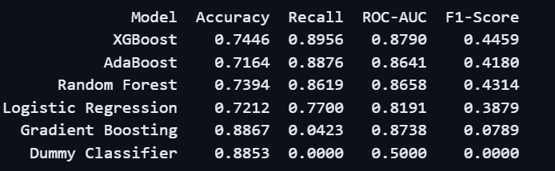

# **TERRY TRAFFIC STOPS-TO-ARREST PREDICTION** 

## **Overview**
Traffic stops are usually made by the police whenever they detect suspicious drivers. However, as much as suspicion exists, not all stops lead to a formal arrest since it may be a situation of mistaken identity or just a false call. This project leverages over 65,000 Seattle Police Department records to predict arrest outcomes, providing a viable data-driven tool for auditing law enforcement transparency. By analyzing the available robust features, the model successfully navigates class imbalance to identify the key factors driving police decision-making.

## **Business Understanding**
This project seeks to develop a predictive model that can accurately forecast whether a traffic stop will result in an arrest. This model aims to assist law enforcement agencies in making informed decisions during traffic stops hence ensuring that adequate resources have been allocated effectively and that officers are better prepared for potential outcomes. Nonetheless, the model also seeks to enhance transparency and accountability within law enforcement by providing insights into the factors that influence arrest decisions.

## **Data Understanding**
The [dataset](Data/Terry_Stops_20251229.csv) used in this project is sourced from the Seattle Police Department and contains detailed records of traffic stops conducted over several years. The dataset includes various features such as the date and time of the stop, location, officer and subject demographics, reason for the stop, and whether an arrest was made.

## **Data Preparation**
This phase involved several steps to ensure the dataset was clean and suitable for modeling. 
This included:
 * Dropping duplicate entries
 * Handling missing values 
 * Reducing the placeholders used to represent unknown and unidentified data entries.
 * Encoding categorical variables and normalizing numerical features. 
 
 Additionally, I also saw the necessity for feature engineering to create new variables that could effectively enhance the model's predictive power.

## **Feature Engineering**
The following new features were created to enhance the predictive power of the model:
 * Extracted the Hour, Month, DayOfWeek and Year from the `Occurred Date` column so as to be able to effectively study arrest patterns  by hour, Month, DayOfWeek and Year respectively.
    * Also created Time Buckets e.g Morning, afternoon, evening and night to study how arrest rates vary throughout the day.
    * Created a specific Weekend Flag where; `1=Weekend, 0=Weekday` so as to determine whether the weekend has any significant impact on the arrest flags.
    * Mapped hours and months onto a circle so that 23 and 0 are close neighbors hence the model can learn that these patterns are close together using Cyclical Encoding. This allows the model to learn "Late Night" patterns correctly.
 
 * Introduced Officer-Subject demographical relationships so that the model can learn whether any such relationships might have led to any stops and arrest flags. 
   
   * `Age_Difference`: A large gap (e.g., 50-year-old officer vs. 16-year-old subject) might lead to different communication styles or outcomes compared to peers (25 vs. 25).

   * `Same_Race / Same_Gender` flags: Sociological research often suggests that in-group vs. out-group dynamics can influence stop outcomes. This feature lets the model test that hypothesis mathematically.

   * `Minority_Interaction`: This explicitly isolates cross-racial interactions involving the majority group, which can be a strong predictor for bias-related patterns.

## **Feature Selection**
I retained key demographic attributes for both subjects and officers, including `Subject Age Group`, `Gender` and `Race`. There was also a need to engineer 'Officer-Subject Interaction Features' such as `Same Race Flag` and `Minority Interaction Flag` to explicitly model the sociological dynamics of the stop, allowing the algorithm to detect potential in-group/out-group patterns. To capture the operational context of each stop, `Call Type` and `Frisk Flag`, which serve as strong proxies for the initial severity of the situation. 

Since police activity follows distinct time-based patterns, I extracted `Hour`, `Month` and `Weekend Flag` to account for seasonality and time-of-day risk factors. Consequently, I excluded the `Occurred Date` feature.

I excluded features such as `Stop Resolution` and `Final Call Type` to prevent data leakage since they are determined after the arrest decision is made. I also dropped high-cardinality identifiers like `Subject ID`, `GO / SC Num`,`Officer ID`, `Beat` and `Terry Stop ID` to improve model generalizability.
    
## **Modelling**
Given the imbalanced nature of the dataset (89% no arrest, 11% arrest), I evaluated multiple machine learning algorithms to predict arrest outcomes. 

Six models were tested:
|  |  |
| :--- | :--- |
|1. Dummy Classifier (baseline) | 4. Gradient Boosting| 
|2. Logistic Regression| 5. AdaBoost
|3. Random forest | 6. XGBoost
 
  

**Critical Metrics for My Terry Stops Analysis**

In developing this predictive model for law enforcement, I decided to prioritize specific metrics that align with the operational realities and safety requirements of police work.

 1. *Recall - My Primary Focus*

 I considered recall the most critical metric because missing an actual arrest poses significant risks to officer safety and operational preparedness. A model's ability to catch 89.6% of actual arrests means officers are rarely caught off-guard by unexpected arrest situations. In law enforcement, it's far better to be over-prepared than surprised.

 2. *ROC-AUC - My Confidence Measure*

I relied on ROC-AUC as my primary performance indicator because it effectively handles the severe class imbalance in my dataset (89% no arrest, 11% arrest). This metric tells me that my model can correctly rank a randomly chosen arrest case higher than a no-arrest case 87.9% of the time, providing reliable risk assessment capabilities for resource allocation.

3. *F1-Score - My Balance Indicator*

I used F1-Score to ensure my model strikes the right balance between catching arrests and avoiding excessive false alarms. While high recall may create more false positives, the F1-Score ensures that I'm maintaining reasonable precision without compromising the critical need to identify potential arrests.

4. *Accuracy - My Acceptable Trade-off*

I will accept lower accuracy for a higher recall so as to discourage the model from simply predicting the majority class. False positives (predicting arrest when none occurs) are operationally manageable, while false negatives (missing actual arrests) can compromise officer safety and public security. My design philosophy thus prioritizes preparedness over efficiency.

 

### **Model Evaluation**

XGBoost emerged as the best performing model with:

 * Highest ROC-AUC (0.8790) hence distuinguished clearly between Arrests and No Arrests. This model can thus reliably identify the stops that are more likely to result in arrests.

 * The model also catches 89.6% of actual arrests(recall). Even though this leads to more false positives,  this high recall ensures officers are rarely surprised by unexpected arrest situations.

 * With an F1-Score of 0.4459 shows that this model is striking a reasonable balance between cathing the real arrests and not having many false alarms.

 * Compared to the other models, an 74% accuracy is not remarkable but it shows that the model is trying to get the arrests rather than taking the easy path of always predicting 'No arrests'.

 ## **Conclusion**
 This project successfully developed a predictive model for Terry stop arrest outcomes using 65,931 Seattle Police Department records. Despite the challenging class imbalance (89% no arrest, 11% arrest), the XGBoost model achieved strong performance with an ROC-AUC of 0.8790 and recall of 89.6%, demonstrating its ability to reliably identify high-risk stops while catching nearly 9 out of 10 actual arrests.

**Key Achievements**

* *Effective Feature Engineering*: Created meaningful temporal patterns, officer-subject demographic interactions and cyclical encodings that enhanced model predictive power.

* *Successful Class Imbalance Management*: Prioritized recall over accuracy to ensure officers are prepared for potential arrest situations

* *Actionable Insights*: Provided law enforcement with a data-driven tool for resource allocation and operational planning

**Business Impact**

The model serves as a valuable decision-support tool for law enforcement agencies, enabling better preparation for traffic stops, improved officer safety and more efficient resource deployment. The high recall ensures officers are rarely caught off-guard by unexpected arrests, while the strong ROC-AUC demonstrates reliable risk assessment capabilities.

**Future Recommendations**

* This model should be deployed in a pilot program to validate its real-world performance

* Continuously monitor for bias and fairness across demographic groups

* Integrate additional data sources such as historical crime patterns and environmental factors

* Develop feature importance analysis to provide transparency in decision-making factors

This project demonstrates how machine learning can enhance law enforcement transparency and operational effectiveness while maintaining focus on officer and public safety.